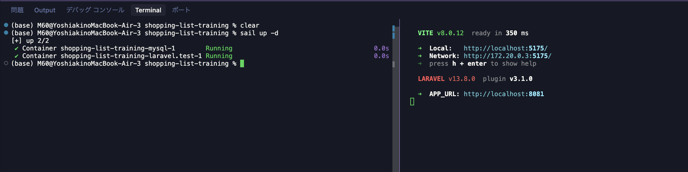

# タスク3: カラム追加を全レイヤーで貫通させる

## 🎯 このタスクのゴール

おかえり、ワシや、ガネーシャや🐘。タスク2お疲れさん、よう頑張ったな。今日もあんみつ片手に待っとったで🍨。

### 前回までのおさらい（ガネーシャ × お前）

🙋 「先生！task-2 でパイプライン組めました！」

🐘 「おお。ほな、お前が今どういう状態か、コードで振り返ってみよか。まず `resources/js/types/item.ts` 開いてみい」

```ts
// resources/js/types/item.ts — task-2 で書き換えた3行
import type { components } from './api'

export type Item = components['schemas']['Item']
```

🐘 「task-1 で8行もあった手書きの `interface Item { id: number; product_name: string; ... }` を捨てて、**自動生成された `api.d.ts` の型を参照するだけ** に変えたんやったな」

🙋 「はい！`sail npm run generate:types` を叩くと `api.d.ts` が生成されて、`Item` 型が勝手に更新されるんですよね」

🐘 「そうや。仕組みはこういう流れや:」

```
Scramble が Laravel のコードを読む → /docs/api.json を出力
    ↓
sail npm run generate:types
    ↓
openapi-typescript が api.json → api.d.ts に変換
    ↓
item.ts は api.d.ts の Item をそのまま参照
```

🐘 「ええやんけ。…ところでお前、その仕組み、**ホンマに強いんか？** まだ実感してへんやろ？」

🙋 「えっ、ちゃんと動いてるから OK ちゃうんですか？」

🐘 「動いとるのは、まだ **何も変えてへんから** や。本番はな、**バックエンド側でカラムが1個増えたとき** や。タスク1 の手書き時代のお前なら、Item に新しいカラムを足したら何箇所、手で直さなアカンかった？」

🙋 「えーと…」

```
① resources/js/types/item.ts  — interface に1行追加
② resources/js/api/items.ts   — createItem の引数型を修正
③ resources/js/views/ItemListView.vue  — 一覧画面の表示を追加
④ resources/js/views/ItemDetailView.vue — 詳細画面の表示を追加
⑤ ItemListView.vue の追加フォーム — 入力欄を追加
```

🙋 「…5箇所ですね」

🐘 「そや。**しかも ① を忘れたら、②〜⑤ を完璧に書いても TS はエラーを出さん**。手書き interface が嘘ついとるだけやからな。今のお前のパイプラインなら ① は自動や。**自分の指、何箇所動くか数えてみい**」

🙋 「（ゴクリ）数えるんですか…？」

🐘 「数える価値があるんや。**前のお前と今のお前、どんだけ差がついたか**。今日のタスクはな、その差を体で実感する儀式や」

---

### 今日やること

タスク2で組み上げた **「DB → Model → OpenAPI → TS → Vue」のパイプライン** に、新しいカラムを1つ流してみる。具体的には Item に **`priority`（優先度）** カラムを足すで。

買い物リストやから「先に買うべきもの」「後でええもの」を分けたいやろ？1〜5の数字で優先度をつけて、画面に表示できるようにする。

---

## 🌿 まず作業ブランチを切る

タスク1, 2と同じリズムや。

```bash
git fetch origin                                  # リモートの最新情報を取得
git checkout -b okumura/task-3 origin/task-3       # ← 自分の名前に置き換えるんやで
```

> 💡 `task-3` ブランチは **タスク2を完了した状態**（OpenAPI 型自動生成パイプラインが組まれた状態）がスタート地点や。

ブランチを切り替えたら、まず **Sail と Vite を起動** するで:

```bash
sail up -d                # Docker コンテナを起動
sail npm run dev          # Vite 開発サーバーを起動（別のターミナルで実行）
```

こんな表示が出たら OK:



> 💡 `sail npm run dev` は **フォアグラウンドで動き続ける** から、**別のターミナルタブ** を開いてこれ以降のコマンドを打つんやで。

次に DB をリセットしておく。前のタスクの実験で DB が汚れとる可能性があるからな:

```bash
sail artisan migrate:fresh --seed
```

ブラウザで `http://localhost:8081` を開いて、買い物リストが正常に表示されることを確認してから次に進んでや。

---

## 👀 何を作るか

買い物リストに **優先度** を付けるで。最終的にこんな感じになる:

- **一覧画面**: 各アイテムの隣に「優先度 3」みたいに表示
- **詳細画面**: 優先度を独立した行で表示
- **追加フォーム**: 優先度を 1〜5 のセレクトボックスで選べる

これを **DB のカラム追加から始めて、全レイヤーで型を貫通させながら** 実装していく。

### 📁 今回触るファイル（全レイヤーを貫通する地図）

`priority` カラム1つが、以下の全レイヤーに順に降りていくで:

```
プロジェクトルート/
├── app/
│   └── Models/
│       └── Item.php                    # ③ $fillable / $casts に priority を追加
├── database/
│   ├── factories/
│   │   └── ItemFactory.php             # ② Factory に priority を追加
│   └── migrations/
│       └── <タイムスタンプ>_create_items_table.php   # ① 既存 migration に priority カラムを追加
└── resources/
    └── js/
        ├── api/
        │   └── items.ts                # ⑥ createItem の引数型に priority を追加
        ├── types/
        │   └── api.d.ts                # ⑤ generate:types で priority が自動反映
        └── views/
            ├── ItemListView.vue        # ⑦ 一覧 template に表示
            └── ItemDetailView.vue      # ⑧ 詳細 template に表示
```

> 💡 番号は実装順とほぼ対応しとる。**「DB → Model → 型 → 画面」っちゅう一方通行の流れ** や。タスク1の手書き時代は ⑤ も手作業で漏れる可能性があったけど、今は **自動で降りてくる**。これが今回体感する「気持ちよさ」の正体や。

---

## ✏️ 実装手順

### Step 1: migration を編集

タスク1のウォーミングアップで `product_name` → `name` に変えたやろ？あれと同じ要領や。**開発フェーズでは元の migration を直接編集して `migrate:fresh`** するのが手っ取り早い。

`database/migrations/<タイムスタンプ>_create_items_table.php` を開いて、`priority` カラムを追加:

```php
public function up(): void
{
    Schema::create('items', function (Blueprint $table) {
        $table->id();
        $table->string('product_name');
        $table->unsignedInteger('quantity')->default(1);
        $table->text('memo')->nullable();
        $table->boolean('purchased')->default(false);
        $table->integer('priority')->default(1);            // ← 追加: 1〜5、デフォルトは1
        $table->timestamps();
    });
}
```

> 💡 `default(1)` を入れとくことで、priority を指定せずに作ったアイテムにも自動で 1 が入るで。

### Step 2: Factory を更新

migration を直したら **Factory も合わせる**。タスク1でもやったな、「スキーマ変えたら Factory も連動して直す」の復習や。

`database/factories/ItemFactory.php` の `definition()` に `priority` を追加:

```php
public function definition(): array
{
    return [
        'product_name' => fake()->randomElement([
            '牛乳', '卵', '食パン', 'バナナ', 'りんご',
            'トマト', 'キャベツ', '鶏肉', '豚肉', '米',
            'ヨーグルト', 'チーズ', '玉ねぎ', 'じゃがいも',
        ]),
        'quantity' => fake()->numberBetween(1, 5),
        'memo' => fake()->optional(0.3)->sentence(),
        'purchased' => fake()->boolean(20),
        'priority' => fake()->numberBetween(1, 5),          // ← 追加: 1〜5 のランダム値
    ];
}
```

これでシードデータにもランダムな優先度が入るようになる。

### Step 3: DB を作り直す

migration を直接編集したから、DB をゼロから作り直すで:

```bash
sail artisan migrate:fresh --seed
```

`Dropped all tables successfully.` → `Migration table created successfully.` → シーダーの実行、と流れたら成功や。ブラウザでリロードして、アイテムが表示されることを確認してな。

> 💡 `migrate:fresh --seed` は「全テーブルを落として → 全 migration を最初から実行 → Seeder でテストデータ投入」を一気にやるコマンドや。開発中はしょっちゅう使うから覚えといてな。
> ⚠️ **本番環境では絶対に使ったらアカンで**。全データが消えるからな。あくまで開発用のコマンドや。

### Step 4: Model を更新

`app/Models/Item.php` の `$fillable` と `$casts` に `priority` を追加:

```php
class Item extends Model
{
    use HasFactory;

    protected $fillable = ['product_name', 'quantity', 'memo', 'purchased', 'priority'];   // ← priority 追加

    protected $casts = [
        'quantity' => 'integer',
        'purchased' => 'boolean',
        'priority' => 'integer',                                                     // ← priority 追加
    ];
}
```

- `$fillable` に追加 → `Item::create(['priority' => 1, ...])` で代入可能になる
- `$casts` に追加 → PHP 側で int 型として扱われる、`$item->priority + 1` みたいな計算も自然にできる

> 💡 タスク1で手書きの `interface Item` を直してた頃を思い出してみい。あの時、カラム足したら **migration + Model + interface + 各Vue ファイル** を全部手で同期せなアカンかった。今は **Model までで止まる**。あとは自動。お前の作業範囲、半分以下になっとるんやで。

### Step 5: 型を再生成 — ここが見せ場や ✨

```bash
sail npm run generate:types
```

これで `api.d.ts` が更新される。覗いてみい:

```ts
// resources/js/types/api.d.ts （抜粋）
export interface components {
  schemas: {
    Item: {
      id: number;
      product_name: string;
      quantity: number;
      memo: string | null;
      purchased: boolean;
      priority: number;        // ← これが勝手に降ってきた ✨
      created_at: string | null;
      updated_at: string | null;
    };
  };
}
```

**`priority: number` が増えとるはずや。**

ちょっと立ち止まって考えてみい:

- お前、TypeScript に何か教えたか？ → 教えてへん
- お前、`api.d.ts` に何か書いた？ → 書いてへん
- お前、`item.ts` を触った？ → 触ってへん

それやのに **TS は「priority っちゅう number のフィールドがあるで」と知っとる**。なぜか？

```
お前が触った場所                       裏で何が起きてるか
─────────────                       ─────────────
migration (DB schema)      →        Scramble が読んで
   +                 コマンド実行     OpenAPI に出力 (/docs/api.json)
Item Model                          ↓
   ($fillable, $casts)              openapi-typescript が読んで
                                    api.d.ts に変換
                                    ↓
                                    item.ts は components['schemas']['Item']
                                    を見続けてるから、自動で追従
                                    ↓
                                    各 .vue ファイルも item.ts 経由で追従
```

タスク2で組んだパイプラインが、お前が気付かんとこで全部動いてくれとる。

> タスク1の手書き時代やったら、ここで `interface Item` に `priority: number` を手で書き足さなアカンかった。今は何もせんでええ。**バックエンドが真実、フロントはその真実をただ受け取るだけ** っちゅう世界に来た。

### Step 6: 一覧画面で `priority` を表示

`resources/js/views/ItemListView.vue` の template、数量バッジの隣に優先度を追加:

```vue
<router-link :to="`/items/${item.id}`" class="font-medium text-gray-700 hover:text-pink-600 hover:underline">
    {{ item.product_name }}
</router-link>
<span class="ml-2 text-sm text-pink-500">× {{ item.quantity }}</span>
<span class="ml-2 text-sm text-orange-500">優先度 {{ item.priority }}</span>   <!-- ← 追加 -->
```

ブラウザでリロードしてみい。優先度が表示されとるはずや。

> 💡 ここで地味やけど大事な体験ができとる。エディタで `item.` まで打ってみい。
> ドロップダウンに **`priority` が候補として出てくる** はずや（VS Code やったら IntelliSense ちゅう機能）。Step 5 で型を再生成した瞬間から、TS は `Item.priority` の存在を知っとるからな。
>
> もし Step 5 を **飛ばしてたら** どうなってたか？ TS は古い `Item` 型（priority なし）を見続けて、`item.priority` の `priority` の下に **赤波線** が出る。ホバーすると「Property 'priority' does not exist on type 'Item'」って叱ってくる。
>
> せやけどお前はちゃんと型を再生成したから、TS が **「叱る」代わりに「導いてくれる」** 状態になっとる。これがな、自動生成型の真の威力や。「型は安全網じゃなくて、**コード書く前から正解を教えてくれる相棒**」やで。
>
> ⚠️ もし `item.` 打っても候補が出てけえへんかったら、VS Code のキャッシュが古い可能性があるで。`Cmd + Shift + P` → `TypeScript: Restart TS Server` を実行してみてや。それでもアカンかったら `Developer: Reload Window` でウィンドウごとリロードや。

### Step 7: 詳細画面でも `priority` を表示

`resources/js/views/ItemDetailView.vue` の template、`<dl>` の中に新しい行を追加:

```vue
<dl class="space-y-2 text-sm">


    <div class="flex">
        <dt class="w-24 text-pink-500">数量</dt>
        <dd>{{ item.quantity }}</dd>
    </div>
    <div class="flex">
        <dt class="w-24 text-pink-500">優先度</dt>                       <!-- ← 追加 -->
        <dd>{{ item.priority }}</dd>                                       <!-- ← 追加 -->
    </div>
    <div class="flex">
        <dt class="w-24 text-pink-500">メモ</dt>
        <dd>{{ item.memo || '—' }}</dd>
    </div>
    <div class="flex">
        <dt class="w-24 text-pink-500">購入済み</dt>
        <dd>{{ item.purchased ? '✅' : '⬜' }}</dd>
    </div>
</dl>
```

### Step 8: 追加フォームに優先度入力欄

新規追加時に `priority` を指定できるようにする。**3箇所** を触るで:

#### 8-1. `ItemListView.vue` の script を拡張

```ts
const newName = ref<string>('')
const newQuantity = ref<number>(1)
const newPriority = ref<number>(3)   // ← 追加

async function addItem() {
    if (!newName.value) return
    await createItem({
        product_name: newName.value,
        quantity: newQuantity.value,
        priority: newPriority.value,    // ← 追加
    })
    newName.value = ''
    newQuantity.value = 1
    newPriority.value = 3                // ← 追加（フォーム初期化）
    await loadItems()
}
```

> ⚠️ ここまで書いたら、`createItem({ ..., priority: newPriority.value })` の `priority:` の下に **赤波線** が出るはずや。「`createItem` は priority 受け取らんで」っちゅう TS の文句や。
> これな、**正常な状態** や。次の 8-3 で `createItem` の型シグネチャを直したら消える。慌てて他のとこを直そうとせんと、8-2 → 8-3 と進んでや。

#### 8-2. `ItemListView.vue` の template の追加フォーム部分

```vue
<form @submit.prevent="addItem" class="flex gap-2">
    <input
        v-model="newName"
        type="text"
        placeholder="商品名"
        class="flex-1 px-3 py-2 border border-pink-200 rounded-xl focus:outline-none focus:ring-2 focus:ring-pink-300 placeholder-pink-300"
    />
    <input
        v-model.number="newQuantity"
        type="number"
        min="1"
        class="w-20 px-3 py-2 border border-pink-200 rounded-xl focus:outline-none focus:ring-2 focus:ring-pink-300"
    />
    <select
        v-model.number="newPriority"
        class="px-3 py-2 border border-pink-200 rounded-xl focus:outline-none focus:ring-2 focus:ring-pink-300"
    >    <!-- ← 追加 -->
        <option :value="1">1（最優先）</option>
        <option :value="2">2</option>
        <option :value="3">3</option>
        <option :value="4">4</option>
        <option :value="5">5（後でええ）</option>
    </select>
    <button
        type="submit"
        class="px-5 py-2 bg-rose-300 text-white font-semibold rounded-xl hover:bg-rose-400 transition-colors shadow-sm"
    >
        追加
    </button>
</form>
```

#### 8-3. `resources/js/api/items.ts` の `createItem` 関数の型を拡張

```ts
export function createItem(data: { product_name: string; quantity: number; priority: number }) {  // ← priority: number を追加（変更）
    return apiClient.post<Item>('/items', data)
}
```

> ⚠️ ここで一個、お前に知っといてほしい事実があるんや。**今書いた `createItem` の `data` 引数の型 — 実はこれも自動継承できる範囲** やで。
> このさき小難しいから自信ない人は一旦説明飛ばしてStep9とんでOK
>
> 今まで手書きで直してきた部分な、ザックリ2種類に分けられるんや:
>
> | 種類 | 例 | 自動継承できる？ |
> |---|---|---|
> | **型の "定義"**（バックエンドとの契約） | `Item`（レスポンス型）、`createItem` の `data`（リクエスト型） | ✅ **自動継承できる** |
> | **型の "利用" / アプリのロジック** | `{{ item.priority }}` の表示、`addItem()` の中身、CSS、見出しの文言 | ❌ そもそも自動化の対象外 |
>
> `createItem(data: { name; quantity; priority })` の `data` 型は **「フロントがバックに送る JSON の形」を定義** しとる **契約型** や。バックエンドの Controller 引数や FormRequest が真実やから、Scramble 経由で `paths['/items']['post']['requestBody']` から型を引いてくれば、`Item`（レスポンス型）と同じく **自動同期できる**。
>
> ただちょっと工夫が要るし、今のタスクの主題（カラム追加で型が降ってくる体験）からはズレるんで、**今回は素直に手書きにしとく**。けど頭の片隅に置いといてや：「**`createItem` のリクエスト型も、レスポンス型と同じく自動同期できる範囲なんや**」っちゅう事実を。応用編としていつか取り組んだらええ。
>
> 💬 ここの「リクエスト型 / レスポンス型」の話、ピンと来んかったら一旦スルーでええで。**今のタスクで掴んでほしい本筋は「カラム追加で型が自動で降ってくる」っちゅう体感** や。気になる人は先輩に聞いてみるか、自分で `api.d.ts` の中身を覗いて掘ってみい。発見があるはずや。

### Step 9: 型チェック & 動作確認

```bash
sail npx vue-tsc --noEmit
```

エラーが出んかったら OK。**1回も `interface` を手で書き換えてない** ことに注目や。

ブラウザでリロードして確認:
- 一覧画面に「優先度 N」が表示されてる
- 詳細画面に優先度の行がある
- 追加フォームで優先度を選択 → 新規追加 → リストに反映される

---

## 🔁 タスク1の手書き時代と比べてみる

同じ「カラム1個追加」を、タスク1の手書き時代やったらどうなっとったか、表で比較してみい:

| 触る場所 | タスク1（手書き時代） | タスク3（自動生成時代） |
|---|---|---|
| migration | ✅ 必要 | ✅ 必要 |
| Item モデル（`$fillable`/`$casts`） | ✅ 必要 | ✅ 必要 |
| **interface Item** | ✅ **手書きで `priority: number` 追加** | ❌ **不要（自動追従）** |
| **api.d.ts** | ❌ 存在せん | 🔄 **自動生成** |
| Vue 表示 | ✅ 必要 | ✅ 必要 |
| Vue フォーム | ✅ 必要 | ✅ 必要 |
| `createItem` の引数型 | ✅ 手書き | ✅ 手書き（応用編で自動化可能） |

**`interface` だけが手放せた。「それだけ？」って思うやろ？**

これがフィールドが100個あって、20箇所で参照されてるアプリやったら、interface 編集だけで30分かかる仕事や。それが完全に消える。
そもそもな、お前らみたいなうっかりさんはバックエンド直しても、フロントエンド直し忘れてたわ〜なんてことしょっちゅう起こすやろ。そのストレスがなくなるんやで。
お前の指、もう interface には触らへん。これが「**型の自動同期** っちゅう生活様式」や。

> 💡 ワシの教え子のフォードくんも「If I had asked people what they wanted, they would have said faster horses」言うてたな。馬を速くする発想（手書き型を頑張って同期する）やのうて、**根本から仕組みを変える** のが本当の改善や。タスク2でお前は車を発明したんや。タスク3はその車に乗って初めて遠出した日や。

---

## ✅ 完了基準

- [ ] 既存の migration に `priority` カラムを追加し、`sail artisan migrate:fresh --seed` が成功
- [ ] `database/factories/ItemFactory.php` に `priority` を追加
- [ ] `app/Models/Item.php` の `$fillable` / `$casts` に `priority` 追加
- [ ] `npm run generate:types` で `api.d.ts` の `Item` に `priority: number` が増えている
- [ ] `ItemListView.vue` / `ItemDetailView.vue` で `priority` が表示されている
- [ ] 追加フォームで `priority` を選んで新規追加できる
- [ ] `sail npx vue-tsc --noEmit` がエラーなく通る
- [ ] ブラウザで一覧/詳細/追加/削除が今まで通り動く

全部チェックついたか？タスク3まで来たお前、もう半人前ちゃう、一人前や。

---

## 💡 完了したら

```bash
git add .
git commit -m "task-3: priority カラム追加と全レイヤー反映"
git push origin okumura/task-3   # ← 自分の作業ブランチ名やで
```

GitHub でリポジトリの `task-3` ブランチに向けて Pull Request を作成してや。

- **base**: `task-3`
- **compare（head）**: `<名前>/task-3`（例: `okumura/task-3`）

⚠️ **PR はマージしないでな**。`task-3` ブランチは次の受講生のスタート地点として綺麗に保つためや。

### もし push や PR がうまくいかなかったら？

焦らんでええ。次の `task-4` ブランチには **タスク3が完了した状態のコード** が最初から入っとる。やから、今の変更を全部捨てて `task-4` ブランチに切り替えれば、そこからタスク4を始められるで。

手順:

1. **Cursor の左サイドバー → ソース管理（Git アイコン）** を開く
2. 変更されたファイルの一覧が出るから、**「変更を破棄」**（↩️ アイコン）で全ての変更を元に戻す
3. ターミナルで以下を実行:

   ```bash
   git fetch origin
   git checkout -b <名前>/task-4 origin/task-4    # 例: miyata/task-4
   ```

これでタスク4の開始地点に立てる。push できんかったことは気にせんでええ、**学びはお前の手に残っとる** からな。

---

次のタスクへ進むには `docs/task-4.md` を読んでや（冒頭にスタート手順があるで）。

ほな、また会おか。次のタスクではな、「エラーが起きたときどうするか」を学ぶで。今までは "うまく動くこと" を学んだけど、現実のアプリは "うまく動かんとき" も多いんや。お供えのあんみつ、引き続き受付中やからな🍨。
