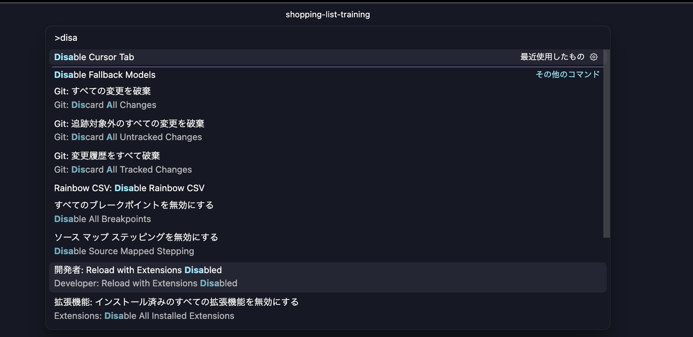

# タスク4: 型再生成を「忘れる」仕組みを潰す

## 🎯 このタスクのゴール

おかえり、ワシや、ガネーシャや🐘。タスク3お疲れさん、よう頑張ったな。今日もあんみつ片手に待っとったで🍨。

### 前回までのおさらい（ガネーシャ × お前）

🙋 「先生！task-3 で `priority` カラム追加、サクッと貫通しました！migration 書いて、Item モデル更新して、`sail npm run generate:types` を叩いたら、フロントの型に一瞬で `priority` が現れて…めっちゃ気持ちよかったです！」

🐘 「おお、ええ感じやないか。…ところでお前、いま **自分が何を叩いたか**、もう一回言うてみい」

🙋 「えっと…`sail npm run generate:types` ですか？」

🐘 「そや。**それな、お前の指が必要やった唯一の手作業** や」

🙋 「あ…そういえば、それだけは手で叩きました」

🐘 「次の機能で、その次の機能で、半年後の改修で、お前は毎回それを **忘れずに実行できるか？**」

🙋 「…たぶん、忘れます」

🐘 「正直でよろしい。**忘れたら？** 型が古いまま → 補完が嘘をつく → 実行時バグや。タスク2で学んだ **"バックエンドが真実"** の前提が、**お前の記憶力次第** で崩れる」

🙋 「えっ、せっかく組み上げた仕組みが、最後の1コマンドを忘れるだけで台無しに…」

🐘 「そや。やからな、**"覚えとこう" やのうて、"忘れても勝手に走る" 状態** を作るんや。今日はそれを **2つの仕掛け** で実現するで」

---

### 今日やること

タスク3 でカラム追加したとき、お前はこの手順を踏んだはず:

```
1. migration を書く
2. Item モデルを更新する
3. → sail npm run generate:types ← ★ ここを忘れたら型がズレる
4. フロントで型補完が効く
```

この 3 を **2つの仕掛けで自動化** する:

| 仕掛け | いつ動く | 効果 |
|---|---|---|
| **ファイルウォッチャー** | 開発中、PHP を保存した瞬間 | 型がリアルタイムで更新される。ズレた型でコードを書く時間がゼロ |
| **git hook** | `git commit` した瞬間 | ウォッチャーを起動し忘れていた場合の安全網 |

> 💡 ワシの教え子のベンジャミン・フランクリンくんが「**An ounce of prevention is worth a pound of cure**（1オンスの予防は1ポンドの治療に値する）」言うてたな。「忘れたら直す」やのうて、「**忘れる余地を仕組みで潰す**」のが熟練エンジニアのやり方や。

---

## ⚠️ 最初にやること: AI の自動補完を切る

このトレーニングでは **自分の手でコードを打つ** のが大事や。Cursor の AI 補完が有効やと、お前が考える前に答えが出てしもうて学習効果がなくなるからな。

以下の手順で AI 補完を無効にするで:

1. `Cmd + Shift + P` でコマンドパレットを開く
2. `disa` と入力
3. **Disable Cursor Tab** を選択（AI のインライン補完を無効化）
4. もう一度 `Cmd + Shift + P` → `disa` → **Disable Fallback Models** を選択



> 💡 トレーニングが終わったら、同じ手順で `Enable Cursor Tab` / `Enable Fallback Models` で元に戻せるで。

---

## 🌿 まず作業ブランチを切る

タスク1〜3と同じリズム。

```bash
git fetch origin                                  # リモートの最新情報を取得
git checkout -b okumura/task-4 origin/task-4       # ← 自分の名前に置き換えるんやで
```

> 💡 `task-4` ブランチは **タスク3を完了した状態**（priority カラム + OpenAPI 自動生成パイプライン完成）がスタート地点や。

ブランチを切り替えたら、まず **Sail と Vite を起動** するで:

```bash
sail up -d                # Docker コンテナを起動
sail npm run dev          # Vite 開発サーバーを起動（別のターミナルで実行）
```

こんな表示が出たら OK:


> 💡 `sail npm run dev` は **フォアグラウンドで動き続ける** から、**別のターミナルタブ** を開いてこれ以降のコマンドを打つんやで。

次に DB をリセットしておく。前のタスクの実験で DB が汚れとる可能性があるからな:

```bash
sail artisan migrate:fresh --seed
```

ブラウザで `http://localhost:8081` を開いて、買い物リストが正常に表示されることを確認してから次に進んでや。

---

## 👀 何を作るか

今回使う道具は **たった1つの npm パッケージ** と **シェルスクリプト1ファイル** だけ:

| 道具 | 役割 |
|---|---|
| **chokidar-cli** | ファイルの変更を監視して、指定したコマンドを自動実行する CLI ツール |
| **.githooks/pre-commit** | git commit の直前に自動実行されるシェルスクリプト |

> 💡 `concurrently` はタスク3の時点で既にインストール済みや。Vite とファイルウォッチャーを同時に動かすのに使う。

仕掛け①（ファイルウォッチャー）の流れ:

```
sail npm run dev
  ├── vite            ← フロントの HMR（今までと同じ）
  └── chokidar        ← app/**/*.php を監視
        │
        │  Item.php を保存 💾
        ▼
        generate:types が自動実行
        ▼
        api.d.ts が更新される
        ▼
        エディタの型補完も即座に更新 ✨
```

仕掛け②（git hook）の流れ:

```
git commit
  │
  ▼
.githooks/pre-commit が自動実行
  │
  ▼
generate:types が走る
  │
  ▼
api.d.ts が更新され、差分があれば自動で staged に追加
  │
  ▼
commit 完了（型ファイルも一緒にコミットされる）
```

---

## 🔥 ウォーミングアップ: 「忘れる」とどうなるか体感

実装に入る前に、**手動で generate:types を忘れたとき何が起きるか** を実際に体感してみよ。痛みが分かれば、仕組みのありがたみが10倍刺さるで。

### 手順

1. `app/Models/Item.php` に **適当な `$appends` でフェイクの属性** を追加して、JSON 出力に含めるようにする:

   ```php
   class Item extends Model
   {
       use HasFactory;

       protected $fillable = ['product_name', 'quantity', 'memo', 'purchased', 'priority'];

       protected $appends = ['nickname'];   // ← 追加

       protected $casts = [
           'quantity' => 'integer',
           'purchased' => 'boolean',
           'priority' => 'integer',
       ];

       public function getNicknameAttribute(): string   // ← 追加
       {
           return 'にせの属性';
       }
   }
   ```

   これで Item の JSON レスポンスに `nickname` が含まれるようになる。

2. **わざと `sail npm run generate:types` を実行せん** ことに注意して、ブラウザでアプリを開く

3. `ItemListView.vue` のテンプレートで `{{ item.nickname }}` を表示しようとしてみい:

  ```vue
  ...
     {{ item.product_name }}
  </router-link>
  <span class="ml-2 text-sm">{{ item.nickname }}</span>   <!-- ← 追加 -->
  ```

### 何が起こったか確認

3つの観察ポイントを見てみい:

**① ブラウザ画面** → `にせの属性` と表示されとる。**ちゃんと動いてる**ように見えるやろ？

**② エディタ** → `item.nickname` の `nickname` の下に **赤波線** が出る:

```
Property 'nickname' does not exist on type 'Item'
（型 'Item' にプロパティ 'nickname' は存在しません）
```

**③ 型チェックコマンド** → ターミナルで以下を実行してみい:

```bash
sail npx vue-tsc --noEmit
```

こんなエラーが出る:

```
resources/js/views/ItemListView.vue(95,48): error TS2339:
Property 'nickname' does not exist on type
'{ id: number; product_name: string; quantity: number;
  memo: string | null; purchased: boolean;
  created_at: string | null; updated_at: string | null;
  priority: number; }'.
```

TypeScript が「Item 型の定義に `nickname` なんてないぞ」と怒っとる。`api.d.ts` の Item 型には `id`, `product_name`, `quantity`... しかない。`nickname` は **まだ型に反映されてへん** からな。

---

🙋 「え、でも先生、**ブラウザではちゃんと表示されてる** んですよ？エラーなのに動くって矛盾してませんか？」

🐘 「ええ質問やな。ここがな、初心者がいっちばん混乱するポイントや。整理するで」

```
TypeScript の世界（開発時）         JavaScript の世界（ブラウザ）
──────────────────────           ──────────────────────────
api.d.ts に nickname がない       API レスポンスに nickname がある
 → 「そんなプロパティ知らん」        → item.nickname = 'にせの属性'
 → エディタに赤波線               → 普通に表示される
 → vue-tsc がエラー               → エラーなし、正常動作
```

**ブラウザが実行するのは JavaScript** や。TypeScript はブラウザに送られる前に全部 JavaScript に変換されて、**型情報は捨てられる**。やから `item.nickname` は JavaScript 的には「オブジェクトのプロパティにアクセスする」っちゅうだけの話で、API がちゃんと返してくれるから普通に動く。

🙋 「じゃあ TypeScript のエラーなんて無視していいんですか？」

🐘 「**絶対にアカン**。今は動いとるけど、これは **将来壊れる爆弾** や。例えばな:」

```ts
// 今日: 動く（API が nickname を返してるから）
{{ item.nickname }}

// 1ヶ月後: 誰かが「nickname いらんな」と $appends から消す
// → API はもう nickname を返さない
// → item.nickname は undefined になる
// → ブラウザに何も表示されない（エラーにもならない）

// さらにこう書いてたら…
item.nickname.toUpperCase()
// → 💥 Cannot read property 'toUpperCase' of undefined
// → アプリがクラッシュ
```

🙋 「うわ…**動いてるから安心してたのに、ある日突然壊れる**…」

🐘 「そや。TypeScript は **『今は動くけど将来壊れるコード』を事前に見つけてくれる存在** なんや。赤波線が出たら『今動いてるからええやろ』やなくて、**『仕組みが壊れとるサイン』** として受け取れ」

> 💀 ワシの教え子のメフィストフェレスくんが「**人間は何かを忘れた瞬間に堕落する**」言うてたな。お前は今、`generate:types` を1回忘れただけで、タスク2 で築いた **「型は降ってくる」っちゅう真実** を裏切ってしもうた。しかも **ブラウザが動いとるから気づかん** っちゅう最悪のパターンや。

### 戻す

実装に入る前に元の状態に戻す:

1. `Item.php` から `$appends = ['nickname'];` と `getNicknameAttribute()` メソッドを削除
2. `ItemListView.vue` から `{{ item.nickname }}` の行を削除
3. `sail npm run generate:types` を実行して `api.d.ts` も元に戻す

ここまでクリーンになったら、実装に進む。

---

## ✏️ 実装手順

### 仕掛け①: ファイルウォッチャー（開発中の自動化）

#### Step 1: chokidar-cli をインストール

```bash
sail npm install -D chokidar-cli
```

`chokidar-cli` は **ファイルの変更を監視して、変更があったらコマンドを自動実行する** ツールや。OS のファイル監視 API（macOS なら FSEvents、Linux なら inotify）を使うから、CPU をほぼ使わず軽い。

> 💡 実は **Vite 自身も内部で chokidar を使っとる**。ファイル監視のデファクトスタンダードやから、信頼して使ってええ。`chokidar-cli` はそのコマンドライン版。

#### Step 2: `package.json` の `scripts` を書き換える

`package.json` を開いて、`scripts` の `dev` を以下のように変更:

```json
{
  "scripts": {
    "build": "vite build",
    "dev": "concurrently -n vite,types \"vite\" \"SHELL=/bin/sh chokidar 'app/**/*.php' -c 'npm run generate:types' --initial --debounce 500\"",
    "generate:types": "openapi-typescript http://laravel.test/docs/api.json -o resources/js/types/api.d.ts"
  }
}
```

変更したのは **`dev` スクリプトだけ** や。`build` と `generate:types` はそのまま。

各パーツの意味:

| パーツ | 意味 |
|---|---|
| `concurrently -n vite,types` | 2つのプロセスを同時に起動する。`-n` はログに表示する名前 |
| `"vite"` | 今まで通りのフロント開発サーバー |
| `SHELL=/bin/sh` | Docker コンテナ内でシェルを明示的に指定（コンテナでは `$SHELL` 環境変数が未設定のため必要） |
| `chokidar 'app/**/*.php'` | `app/` 配下の全 PHP ファイルを監視 |
| `-c 'npm run generate:types'` | 変更を検知したら実行するコマンド |
| `--initial` | 監視開始時にも1回実行する（起動直後に型を最新にする） |
| `--debounce 500` | 500ms 以内の連続変更は1回にまとめる（保存を連打しても大丈夫） |

🙋 「なんで `app/**/*.php` だけ監視するんですか？」

🐘 「ええ質問や。OpenAPI の仕様に影響するんは **Model や Controller、つまり `app/` 配下の PHP** や。`resources/views/` の Blade を変えても API 仕様は変わらんし、`database/` の migration ファイルを変えても API 仕様は変わらん。**必要なときだけ走る** のがポイントや」

#### Step 3: 動作確認

```bash
sail npm run dev
```

ターミナルにこんな出力が出る:

```
[vite] VITE v8.x.x  ready in ...
[types] Watching "app/**/*.php" ..
[types] > generate:types が実行される（--initial の効果）
```

`[vite]` と `[types]` のプレフィックスで、どちらのプロセスの出力か分かるようになっとる。

**次に、別のターミナルを開いて** `app/Models/Item.php` の `$casts` を変更してみる:

```php
protected $casts = [
    'quantity' => 'string',     // ← 'integer' から 'string' に変更（テスト用）
    'purchased' => 'boolean',
    'priority' => 'integer',
];
```

ファイルを **保存した瞬間**、`sail npm run dev` を動かしているターミナルに:

```
[types] change:app/Models/Item.php
[types] > generate:types が実行される
```

`resources/js/types/api.d.ts` を開いて、`quantity` の型を確認:

```bash
grep 'quantity' resources/js/types/api.d.ts
```

`quantity?: string;` になっとれば、**PHP を保存しただけで型が自動更新された** 証拠や。

🙋 「えっ、保存しただけで勝手に型が変わった…！コマンド何も打ってないのに！」

🐘 「そういうことや。もう **`generate:types` を覚えてなくてもええ**。開発中は chokidar が常に見張っとるからな」

**確認が済んだら `$casts` を元に戻す**:

```php
protected $casts = [
    'quantity' => 'integer',     // ← 元に戻す
    'purchased' => 'boolean',
    'priority' => 'integer',
];
```

保存すると、また自動で `generate:types` が走って `quantity` が `number` に戻る。

> 💡 `sail npm run dev` は `Ctrl + C` で止められる。Vite と chokidar が両方止まるで。

---

### 仕掛け②: git hook（コミット時の安全網）

ファイルウォッチャーは最高やけど、1つだけ弱点がある。**起動し忘れたら無力** っちゅうことや。

🙋 「えっ、`sail npm run dev` を起動せずにコード書くことあります？」

🐘 「あるんや。例えば typo の修正だけやから Vite いらんやろ、って dev を起動せずに直して commit する。そのとき PHP も触っとったら…型は古いままや。やから **commit の瞬間にもう1回チェックする安全網** を張る」

#### Step 4: `.githooks/` ディレクトリとフックスクリプトを作成

```bash
mkdir -p .githooks
touch .githooks/pre-commit
```

次に `.githooks/pre-commit` の中身を書く。**エディタで開いてもええし、ターミナルで一発書き込みでもええ**:

**方法A: エディタで作成**

VS Code 等で `.githooks/pre-commit` を開いて、以下の内容を書いて保存:

```bash
#!/bin/sh

# staged に app/ 配下の PHP ファイルがあるか確認
if git diff --cached --name-only | grep -q '^app/.*\.php$'; then
  echo "🔄 PHP の変更を検知。型を再生成します..."
  ./vendor/bin/sail npm run generate:types
  git add resources/js/types/api.d.ts
  echo "✅ api.d.ts を更新しました"
fi
```

**方法B: ターミナルで作成**

```bash
cat << 'EOF' > .githooks/pre-commit
#!/bin/sh

# staged に app/ 配下の PHP ファイルがあるか確認
if git diff --cached --name-only | grep -q '^app/.*\.php$'; then
  echo "🔄 PHP の変更を検知。型を再生成します..."
  ./vendor/bin/sail npm run generate:types
  git add resources/js/types/api.d.ts
  echo "✅ api.d.ts を更新しました"
fi
EOF
```

作成したら **実行権限を付ける**。これを忘れるとフックが動かん:

```bash
chmod +x .githooks/pre-commit
```

スクリプトの意味:

| 行 | やっていること |
|---|---|
| `#!/bin/sh` | 「このファイルはシェルスクリプトやで」という宣言 |
| `git diff --cached --name-only` | staged されたファイルの一覧を取得 |
| `grep -q '^app/.*\.php$'` | その中に `app/` 配下の PHP があるか確認（`-q` は結果を画面に出さない） |
| `./vendor/bin/sail npm run generate:types` | Sail 経由で型を再生成 |
| `git add resources/js/types/api.d.ts` | 更新された型ファイルを自動で staged に追加 |

> 💡 `if` で囲んでいるのは、**PHP を変更していない commit では何もしない** ようにするため。例えば Vue ファイルだけ変えた commit で毎回 `generate:types` が走ったら無駄やろ？

#### Step 5: git にフックの場所を教える

git は **デフォルトで `.git/hooks/` を見に行く** んやけど、`.git/` の中身はリポジトリに commit できへん（`.git/` は git の管理用フォルダで、リポジトリの一部やないからな）。やから `.githooks/` に置いて、こう設定する:

```bash
git config core.hooksPath .githooks
```

これで **git がフックを探しに行く場所が `.githooks/` に変わる**。この設定はこのリポジトリだけに効く（他のプロジェクトには影響せん）。

> 💡 `git config core.hooksPath` の設定は `.git/config` に保存される。チームで使う場合は README に「`git config core.hooksPath .githooks` を実行してね」と書いておくのが定番や。

#### Step 6: 動作確認

`sail npm run dev` を **止めた状態** で試す（ウォッチャーが動いとったらどっちが効いたか分からんからな）。

**6-1.** `app/Models/Item.php` の `$casts` を変更:

```php
protected $casts = [
    'quantity' => 'string',     // ← 'integer' から 'string' に変更
    'purchased' => 'boolean',
    'priority' => 'integer',
];
```

**6-2.** staged にして commit:

```bash
git add app/Models/Item.php
git commit -m "test: git hook 動作確認"
```

**6-3.** 期待される出力:

```
🔄 PHP の変更を検知。型を再生成します...

> generate:types
> openapi-typescript http://laravel.test/docs/api.json -o resources/js/types/api.d.ts

✅ api.d.ts を更新しました
[okumura/task-4 xxxxxxx] test: git hook 動作確認
 2 files changed, ...
```

ポイントは **`2 files changed`** のところ。`Item.php` だけ staged したのに、フックが `api.d.ts` も自動で追加したから **2ファイル** になっとる。

**6-4.** 中身を確認:

```bash
grep 'quantity' resources/js/types/api.d.ts
```

`quantity?: string;` になっとれば成功。**commit しただけで型が最新になっとる**。

🙋 「すごい！dev を起動してなくても、commit の瞬間に勝手に走ってくれる！」

🐘 「そういうこっちゃ。開発中はウォッチャーがリアルタイムで守る。commit のときは git hook が最後の砦として守る。**二段構えで型のズレを構造的に潰した** っちゅうわけや」

**6-5.** テストが済んだら元に戻す:

```php
protected $casts = [
    'quantity' => 'integer',     // ← 元に戻す
    'purchased' => 'boolean',
    'priority' => 'integer',
];
```

```bash
git add app/Models/Item.php
git commit -m "test: cast を元に戻して git hook 再確認"
```

今回も `2 files changed` になれば、フックがちゃんと動いとる証拠や。

#### 「動かなかった」場合のチェックリスト

| 症状 | 原因 | 対策 |
|---|---|---|
| フックが全く動かない | `core.hooksPath` が設定されていない | `git config core.hooksPath .githooks` を再実行 |
| `permission denied` | 実行権限がない | `chmod +x .githooks/pre-commit` |
| `sail: command not found` | パスが通っていない | スクリプト内を `./vendor/bin/sail` にする（済み） |
| Docker 系のエラー | Sail が起動していない | `./vendor/bin/sail up -d` で起動してから commit |
| PHP を変えたのに動かない | ファイルが `app/` 配下でない | `grep '^app/.*\.php$'` のパターンを確認 |

---

## 🔁 Before / After 比較

| 場面 | Before（タスク3完了時）| After（タスク4完了時）|
|---|---|---|
| 開発中に PHP を保存 | 何も起きない。型は古いまま | **ウォッチャーが即座に型を再生成** |
| commit するとき | `generate:types` を手で叩く必要あり。忘れたら型がズレる | **git hook が自動で走る。忘れる余地がない** |
| 型のズレ | 起こりうる（人間が忘れる） | **構造的に起こらん**（仕組みが防ぐ） |

> 💀 ワシの教え子のフォードくんが組立ラインで「**ヒューマンエラーは "人を責める" んやのうて "仕組みで防ぐ"**」を実証したやろ？お前が今やったのも同じや。**「気を付けます」じゃなく「仕組みが勝手にやる」** を選ぶのが熟練エンジニアの態度や。

---

## ✅ 完了基準

- [ ] `package.json` の `devDependencies` に `chokidar-cli` が入っとる
- [ ] `package.json` の `scripts.dev` が `concurrently` で Vite とファイルウォッチャーを同時起動する設定になっとる
- [ ] `sail npm run dev` を起動した状態で `app/` 配下の PHP を保存 → **自動で `generate:types` が走り** `api.d.ts` が更新される
- [ ] `.githooks/pre-commit` が存在し、実行権限がついとる
- [ ] `git config core.hooksPath` が `.githooks` に設定されとる
- [ ] `app/` 配下の PHP ファイルを変更 → `git commit` → **自動で `generate:types` が走り** `api.d.ts` も一緒にコミットされる
- [ ] `app/` 配下以外（例: Vue ファイルだけ）の変更だけの commit では `generate:types` は走らない
- [ ] ウォーミングアップで仕込んだ `$appends` などの実験コードは元に戻してある

全部チェックついたか？お前、**「コマンド実行の権利」を仕組みに譲り渡した** で。

---

## 💡 完了したら

```bash
git add .
git commit -m "task-4: ファイルウォッチャー + git hook で型再生成を自動化"
git push origin okumura/task-4   # ← 自分の作業ブランチ名やで
```

GitHub でリポジトリの `task-4` ブランチに向けて Pull Request を作成してや。

- **base**: `task-4`
- **compare（head）**: `<名前>/task-4`（例: `okumura/task-4`）

⚠️ **PR はマージしないでな**。`task-4` ブランチは次の受講生のスタート地点として綺麗に保つためや。

次のタスクへ進むには `docs/task-5.md` を読んでや（冒頭にスタート手順があるで）。

### もし push や PR がうまくいかなかったら？

焦らんでええ。次の `task-5` ブランチには **タスク4が完了した状態のコード** が最初から入っとる。やから、今の変更を全部捨てて `task-5` ブランチに切り替えれば、そこからタスク5を始められるで。

手順:

1. **Cursor の左サイドバー → ソース管理（Git アイコン）** を開く
2. 変更されたファイルの一覧が出るから、**「変更を破棄」**（↩️ アイコン）で全ての変更を元に戻す
3. ターミナルで以下を実行:

   ```bash
   git fetch origin
   git checkout -b <名前>/task-5 origin/task-5    # 例: miyata/task-5
   ```

これでタスク5の開始地点に立てる。push できんかったことは気にせんでええ、**学びはお前の手に残っとる** からな。

---

次の **タスク5** はここまでで作ってきた **型安全な世界の上で、初めて「失敗」を扱う** で。API が落ちたら、ネットが切れたら、ユーザーにどう伝える？「エラーハンドリング」っちゅう、フロントエンドの **影の主役** を学んでいくで。

ほな、また会おか。お供えのあんみつは引き続き受付中やからな🍨。
